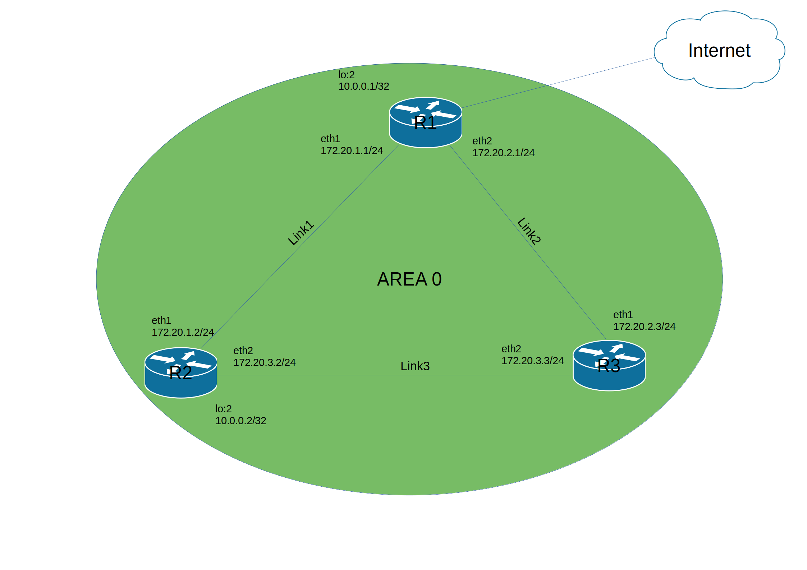
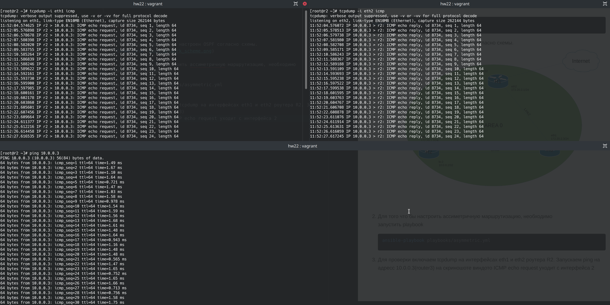

``` bash
vagrant up
```

1. Развернуты вирталки и настроен OSPF согласно схемы.


2. Для того что бы настроить ассиметричную маршрутизацию, необходимо  
запустить playbook (поднимаем цену маршрута на интерфейсе eth2 на маршрутизаторе R2)
``` bash
ansible-playbook playbooks/asymmetric.yml
```

3. Для проверки включаем tcpdump на интерфейсах eth1 и eth2 роутера R2.  
Запускаем ping на адресс 10.0.0.3(router3) на скриношоте виндо ICMP echo request уходит с eth1, а ICMP echo relay возвращается через eth2



4. Для того что бы настроить симетричный маршрут, необходимо запустить playbook symmetric.yml (поднимаем цену маршрута на интерфейсе eth2 на роутере R1)

``` bash
ansible-playbook playbooks/symmetric.yml
```
5. Для проверки так же включаем tcpdump на интерфейсах eth1 и eth2 роутера R2.  
Запускаем ping на адресс 10.0.0.3(router3)

На скриношоте виндо ICMP echo request и ICMP echo relay уходит и возвращается с интерфейса eth2

.png)
